# TYCHO

**TYCHO is a rover teleoperation simulator built on real NASA and USGS elevation data from the Moon and Mars. It models the real signal delay and a co-pilot with labeled uncertainty, and lets you drive it in a browser game.**

[](LICENSE)
[](#run-it-locally)
[](https://threejs.org/)

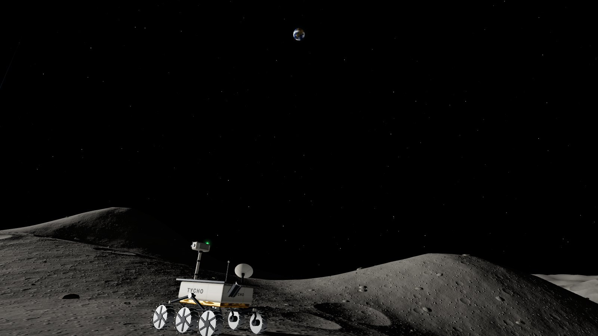
<sub>In-engine capture on the real LROC elevation model of Tycho's central peak (HUD hidden for this one shot). Earth's position in the sky is approximate.</sub>

**[Play it in your browser: tarang-tj.github.io/tycho](https://tarang-tj.github.io/tycho/)**

No install, no account. Built for desktop and phone browsers with WebGL.

---

## Why this exists

On the Moon, a human can steer a rover live. Radio takes about 1.28 seconds to get there, so you press a key, wait a beat, and see what happened. Soviet crews did exactly that with Lunokhod 1 in 1970 and Lunokhod 2 in 1973.

On Mars you can't. The signal takes minutes each way, so by the time you see a cliff edge on your screen, the rover reached it long ago. That's why Mars rovers get a plan for the day and drive themselves between commands.

TYCHO lets you feel that difference with your own hands. Four levels are live driving with a short lag, on real Moon sites (three line-of-sight, one via China's Queqiao relay satellite). Jezero, on Mars, hands over control: you plan, uplink, and trust the co-pilot. Everything you see on screen is telemetry from the past, and when the run ends the game shows you where the rover really was.

## How to play

Every level is one of two modes, described in [The level model](#the-level-model) below: **live** (you drive, a short delay behind) or **plan** (you set waypoints and guardrails, the co-pilot drives, minutes behind).

**Lunokhod (Moon, Le Monnier crater).** Drive to where the real Lunokhod 2 rover has been parked since 1973, at 25.830 N, 30.914 E.

**Tycho (Moon, Tycho central peak).** Drive the last stretch up to the high-point marker near the top of Tycho's central peak.

| Input | Action |
|---|---|
| `W` `A` `S` `D` or arrow keys | Drive and steer |
| On-screen pad | Same, on touch screens |
| Drag / scroll / pinch | Look around and zoom |

Every change in your input is sent to the rover and lands 1.28 s later. The picture you steer by is 1.28 s old. Too steep a slope and TYCHO tips. Reaching Lunokhod 2 doesn't end the mission in fiction: the game shows a short, sourced line ("You reached Lunokhod 2. It has been parked here since 1973.") and nothing more.

**Chang'e-4 (Moon, Von Karman crater, far side).** Drive to China's Chang'e-4 lander, parked at 45.457 S, 177.589 E (LROC's LRO-frame position, matching the shipped DTM) since it landed on 3 January 2019. The lander sits on the lunar far side, with no direct line of sight to Earth, so its signal relays through the Queqiao satellite at the Earth-Moon L2 point instead of crossing straight through the Moon. The HUD shows the sourced, approximate relay path and delay once the level's terrain loads (`assets/change4/meta.json` ships a sourced `delayModel`; a level without one yet would fall back to a labelled placeholder, though Chang'e-4 no longer needs to).

**Apollo 17 (Moon, Taurus-Littrow valley).** Drive to the real Lunar Roving Vehicle, parked at 20.1896 N, 30.7769 E since the astronauts left it there in December 1972. Eugene Cernan and Harrison Schmitt drove the real LRV themselves, on site, with no delay at all; Apollo 17 was the last crewed Moon landing. You are driving TYCHO to it remotely from Earth, 1.28 s behind, the same delay as Lunokhod.

**Jezero (Mars, near the Perseverance landing site).** Reach the goal marker near the base of the delta.

1. Pick a delay scenario (close approach, typical, or near conjunction). The real one-way delay is always shown next to the compression factor used for play.
2. Click the minimap to place up to 5 waypoints, or use the keyboard: arrow keys move a cursor, `Enter` places a waypoint, `Backspace` removes the last one, `U` uplinks. A click near the goal snaps onto it. That's your sol plan.
3. Set the guardrails: **max slope**, **max autonomous distance**, **reroute lookahead**, and whether **co-pilot reroute assist** is on (reroute around hazards) or off (stop at the first one).
4. Optionally hit **Dry run** first: see [Flight Rules](#flight-rules-the-dry-run) below.
5. Hit **Uplink plan** and wait for the signal to arrive. TYCHO's co-pilot drives the plan against the terrain as it really is, then reports back one delay later.

The goal is about 1.8 km out. The default autonomous distance cap (3 km) covers it, so a first plan can win on the defaults at every delay setting. Lower the cap to see the co-pilot hold.

Every level's end card lists that level's **objectives** (arrive, and either beat-the-bot's-par-time plus a slope cap on the Moon, or arrive with the co-pilot's reroute assist on for Mars), each marked met or unmet. After each run a scoreboard compares success with and without the co-pilot, and on Jezero adds a **Flight Rules calibration** line (predicted vs actual arrival rate over your runs that had a dry run first). With fewer than 5 runs any rate says so: `too few runs to trust this rate`. Switching levels or retrying mid-run records that run as **abandoned** and excludes it from every rate, so walking away from a run never counts against (or for) you.

Every end card has a **Copy result** button: it copies a plain-text summary (level, outcome, time, delay, co-pilot on/off, and the game's link) to your clipboard, for sharing; on Jezero it also appends a plain-glyph grid of that run's per-leg outcome (`#` ok, `H` held, `X` tipped, `.` unreached).

### Flight Rules: the dry run

Before committing a Mars plan, **Dry run** simulates it 100 times against the same terrain and guardrails, each run drawing a different seeded **localization drift**: in the game, the co-pilot steers by a *believed* position that drifts a little from the rover's true one. TYCHO models that as a single per-run heading bias, fixed at the start of each simulated sol and applied to every step's true displacement, growing the gap between believed and true position with distance driven - **drift is the only modeled uncertainty in this game, and its size (currently 1% of distance driven) is a game assumption, not a measured rover figure.** That label is shown every time a dry-run result appears, whether or not that particular run happened to lose anything to it.

The dry run reports a count per outcome and a 95%-confidence range on the arrival rate (`tools/measure_fixture_rate.mjs`'s own measurement of the shipped mixed-outcome fixture found N=20 estimates could read anywhere from 30% to 65% against a true rate near 49%, misleadingly noisy for a player decision; N=100 stays within about 40-56%, close enough to trust). Changing a guardrail and running it again shows the trade-off directly. The REAL run that follows an uplink drives through the exact same physics/hold/drift loop (`sol-sim.js`'s `autopilotStep`, not a second copy of it) on a freshly drawn seed the dry run never simulated, so it is never a replay of a result you already saw - and the believed-vs-true gap it drove with is only ever revealed at the end, same as every other level's present-time rule: the end card shows a **"Drift this run"** line with the final believed-minus-true offset in meters, plus a track view (`web/hud-tracks.js`) fitted to THAT run's own drive, not the whole map - a 1% drift is invisible on a map-wide minimap, so the view zooms to the union of the true (solid white) and believed (dashed) tracks, marks their two final points, and draws the offset between them labeled in meters, with a scale bar for scale. When the two endpoints are still too close to tell apart at that zoom (under about 15% of the main view's width - true on almost every run, since a 1% drift is small by design), a small labeled inset (e.g. "zoom 11x") zooms further into just the endpoints, in whichever corner is opposite the run's own direction of travel so it never lands on top of them, and draws the offset segment and its own meters label inside itself, since that's the only place the gap is actually visible once it triggers an inset at all. Nothing about the offset or either track is ever visible before that reveal, and it's cleared on retry.

On the shipped Jezero crop, **"tipped" is not a reachable dry-run/real-run outcome near the goal**: the nearest cell at or above the rover's own fixed 32-degree physical tip limit is over 8 km from spawn, and the mission's 75 s stall timeout caps how far off-course any single excursion can carry the rover before the run is forced to a stop. No guardrail or drift combination can thread both at once without changing the drift model (which Flight Rules will not retune to make results look interesting) or the terrain/mission logic itself.

**Next: Opportunity.** TYCHO's premise is real terrain, so a level only ships once its site has a sourced final position. Opportunity at Perseverance Valley is planned; it needs a sourced final rover position first (see [What's real and what isn't](#whats-real-and-what-isnt)).

## Screenshots

| | |
|---|---|
| 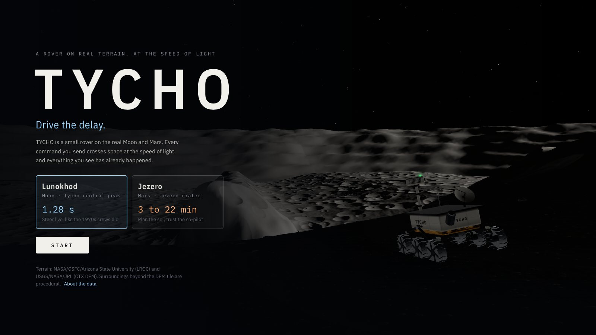 | 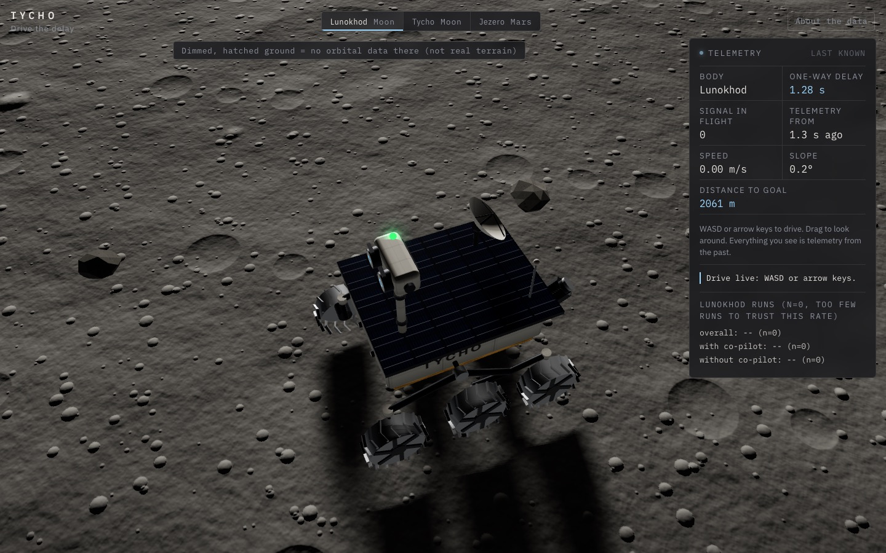 |
| **Title.** Five levels, five real sites. | **Lunokhod.** The parked Lunokhod 2, an illustrative model, labeled at its real surveyed position. |
| 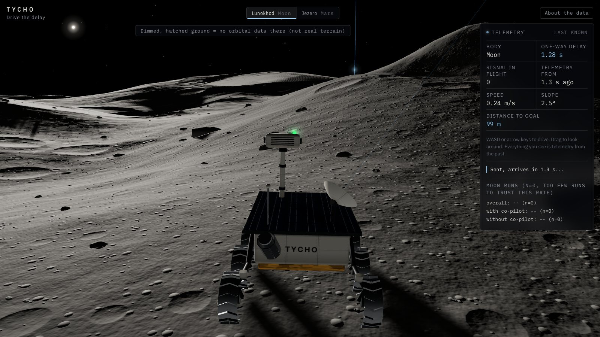 | 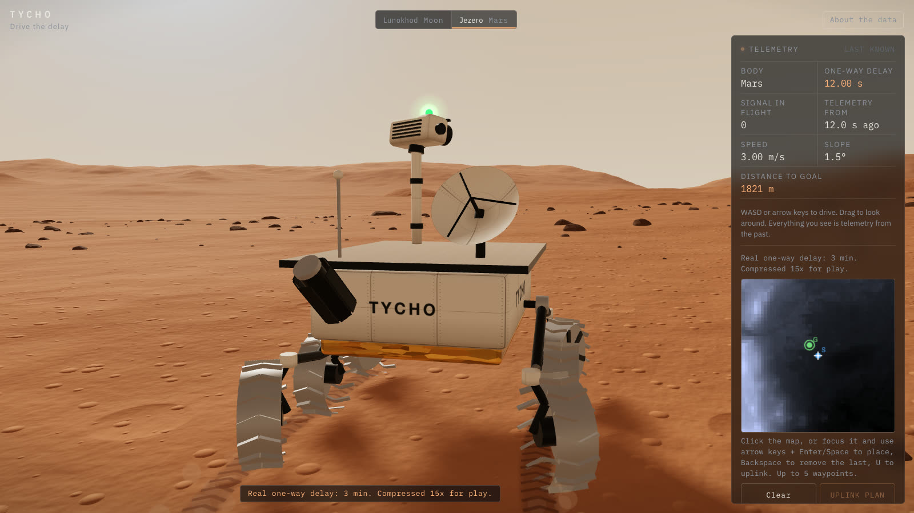 |
| **Tycho.** Live driving up the central peak. The status line shows your last command on its way, and the telemetry you're steering by is 1.3 s old. | **Jezero.** Mid-plan on the real Jezero floor. Real one-way delay 3 min, compressed 15x and labeled on screen. Everything in the panel is 12 s old. |
| 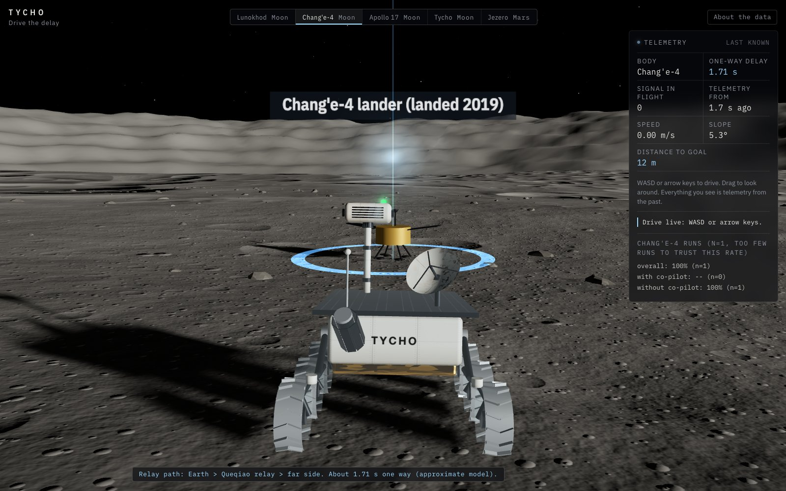 | 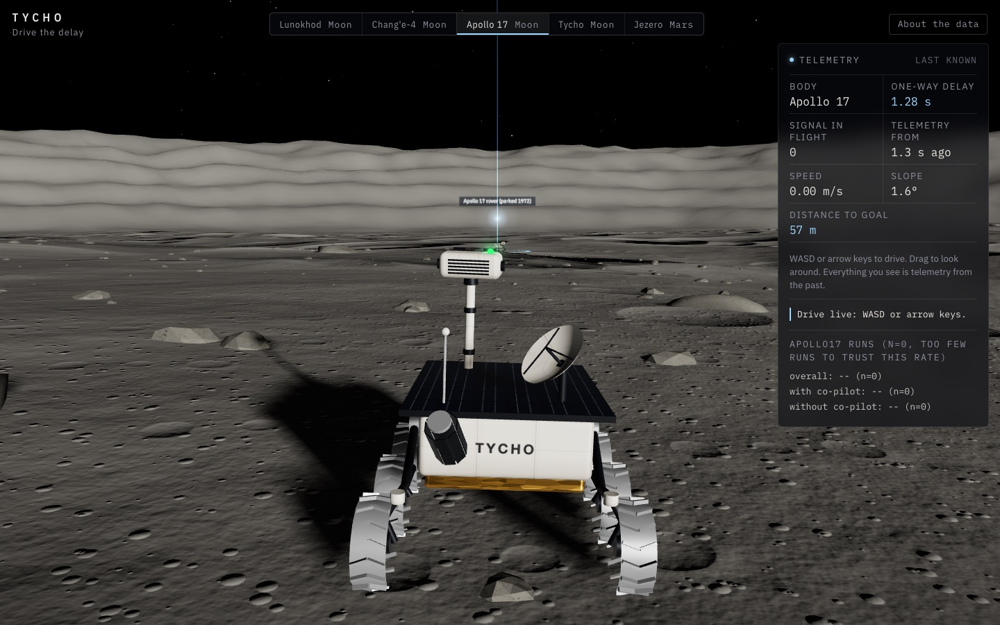 |
| **Chang'e-4.** Approaching the real far-side lander. The relay path and its approximate one-way delay are on screen. | **Apollo 17.** Approaching the real parked LRV in Taurus-Littrow valley. |
| 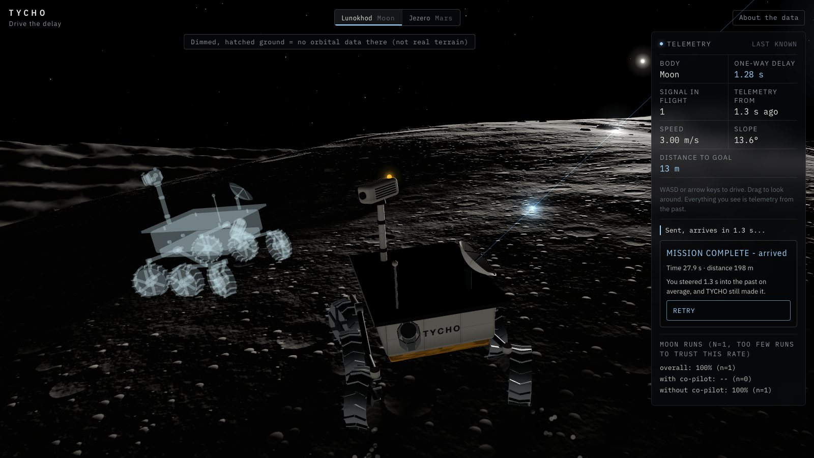 | 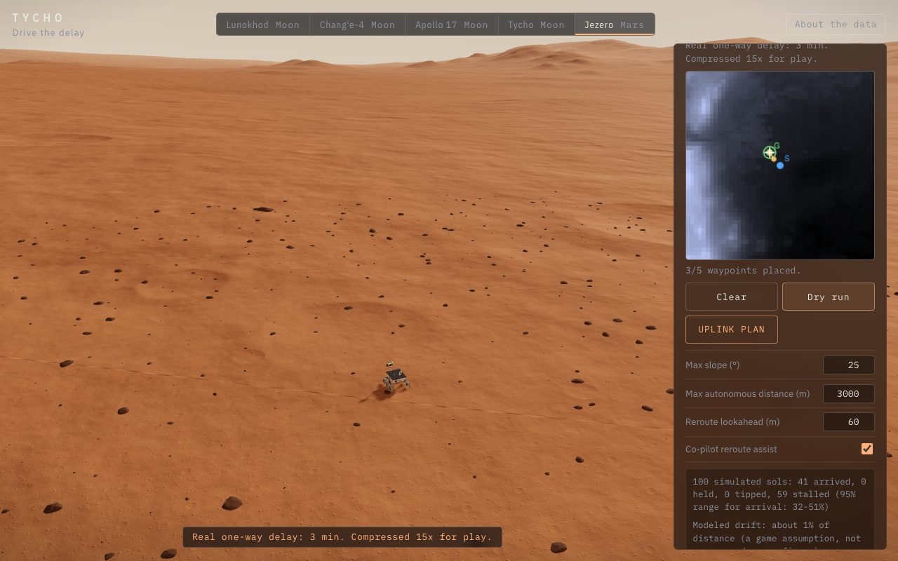 |
| **The reveal.** The solid rover is what you saw. The ghost is where TYCHO really was at that moment. | **Flight Rules dry run.** 100 simulated sols against the current plan and guardrails, with the always-on modeled-drift label. |
| 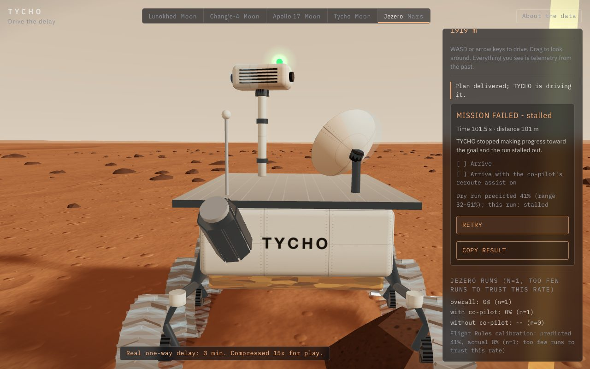 | 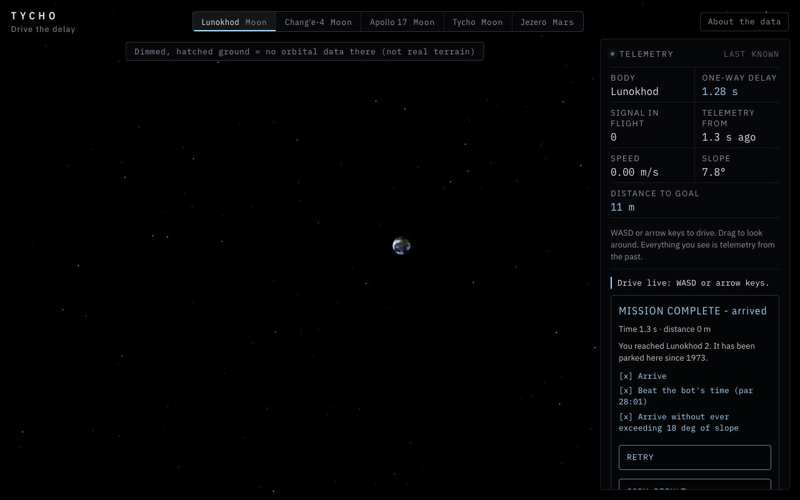 |
| **Jezero end card.** Objectives, the dry run's predicted rate next to this run's real outcome, and the scoreboard's calibration line. | **Moon end card.** Arrive, beat-the-bot's-par-time, and the slope cap, all shown met or unmet. |

<p align="center">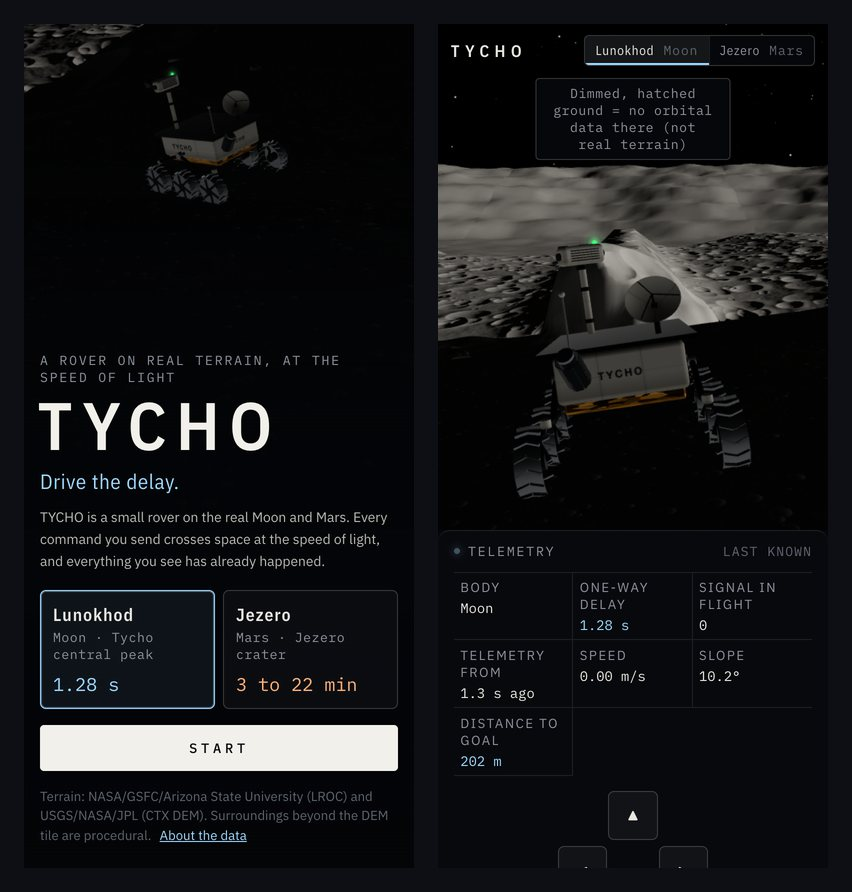</p>

## What's real and what isn't

Honesty is the point of this project, so here's the line, drawn plainly. The same list lives in the game under **About the data**.

| | What | Details |
|---|---|---|
| **Real** | Lunokhod site elevation | LROC NAC DTM `NAC_DTM_LUNOKHOD2` (Le Monnier crater, native 5 m/px). A 5.12 km square crop at native resolution, centered on Lunokhod 2's parked position. 472 m of relief in the crop. |
| **Real** | Lunokhod 2's parked position | 25.830 N, 30.914 E, facing southeast, lid still open. From LROC post 699, "Lunokhod 2 Revisited". The parked-rover model in the goal spot is an illustrative period-accurate silhouette, not a survey model. |
| **Real** | Tycho elevation | LROC NAC DTM `NAC_DTM_TYCHOPK01` (Tycho central peak, native 2 m/px). A 2.4 km square crop resampled to 1024 x 1024, about 2.34 m/px. 1,857 m of relief in the crop. |
| **Real** | Mars elevation | USGS CTX DEM `M20_JezeroCrater_CTXDEM_20m` at native 20 m/px. A 1024 x 1024 window (20.48 km square) centered on the Perseverance landing site, 18.4447 N, 77.4508 E. |
| **Real** | Chang'e-4 elevation and landing position | LROC NAC DTM `NAC_DTM_CHANGE4` (Von Karman crater, native 5 m/px). A 5.12 km square crop at native resolution, centered on the lander's surveyed position, 45.457 S, 177.589 E (±20 m, LRO frame, matching this DTM), landed 3 January 2019. Sources: LROC post 1087, "Chang'e 4 Lander Coordinates" (position); Liu, B. et al. 2019, "Descent trajectory reconstruction and landing site positioning of Chang'E-4 on the lunar farside", *Nature Communications* 10:4229 (landing date; also reports an LRO-frame position agreeing within ~20 m). |
| **Real** | Apollo 17 elevation and LRV position | LROC NAC DTM `NAC_DTM_APOLLO17` (Taurus-Littrow valley, native 5 m/px). A 5.12 km square crop at native resolution, centered on the LRV's parked position, 20.1896 N, 30.7769 E (elevation -2628 m, uncertainty ±3.2 m). Source: LROC, "Spacecraft Related Coordinates - 2016 Update". |
| **Real** | Moon signal delay (Lunokhod, Tycho, Apollo 17) | 1.28 s one way, driven live with no compression. |
| **Real, approximate model** | Chang'e-4 relay delay | About 1.71 s one way through the Queqiao relay satellite: Earth to Queqiao plus Queqiao to the far-side lander, from the NASA Moon Fact Sheet (Earth-Moon distance, Moon radius) and The Planetary Society's reporting on Queqiao's nominal L2 halo distance. A simplified collinear model, not a precise ephemeris (`tools/sites/relay.py` documents the full derivation and its stated uncertainty). |
| **Real, compressed** | Mars signal delay | The real one-way value (3, 12 or 22 min) is always on screen. Play time is compressed 15x, 40x or 55x, so the one-way wait is 12 to 24 s. The compression factor is on screen too. |
| **Real limits, documented in code** | Physics | Rover tips above 32 degrees of slope (`web/rover-sim.js`). The co-pilot's default guardrail is a more cautious 25 degrees (`web/copilot.js`). Slope is measured over a rover-scale 3 m baseline. |
| **Real gaps** | No-data areas | Where the orbital stereo model has no data, the ground is dimmed and hatched and treated as impassable. The rover stops there and the co-pilot won't route through it. Lunokhod's crop has almost none (0.076% of cells); the Tycho crop, cut from a rotated swath edge, has more. |
| **Procedural** | Near-field detail | Small craters, rocks and fine surface texture near the rover are generated decoration. Only the large-scale shape comes from the DEM. |
| **Approximate** | Earth in the lunar sky | Shown at a realistic apparent size, but its sky position is illustrative, not an ephemeris. |
| **Not photos** | Surface color | Shaded from the elevation data with a Moon or Mars palette. No orbital imagery is used. |
| **Data-driven proxies** | Tycho and Mars spawn/goal | Picked by code from the DEM (lowest safe slope, highest reachable point, roughness near the delta), then moved where testing showed the original spot couldn't be won. Every move is logged in `assets/*/meta.json`. Lunokhod's goal is not a proxy (it's the real parked-rover coordinate); its spawn is a code-picked point 2.06 km south, along the rover's real historic approach direction. Chang'e-4 and Apollo 17's goals are the real surveyed coordinates too; neither landing has a sourced approach bearing, so each spawn is code-picked by `tools/sites/common.py`'s `pick_best_spawn`, searched across every compass bearing. Apollo 17's spawn (1.5-3 km out) minimizes the max slope along its straight line to the goal. Chang'e-4's (1.2-1.8 km out) also scores real-route tortuosity and the offset from the rover's starting heading; those terms and the tighter range were added after playtesting found the original range made a delayed-telemetry drive too long to be fun. |
| **Not shipped** | Opportunity | TYCHO's premise is real terrain. No primary source gives Opportunity's precise final position at Perseverance Valley (only prose descriptions and the *landing* site were found), so it isn't shipped rather than shipped on synthetic ground. |

## How it works

TYCHO is plain ES modules in the browser. three.js 0.169 comes from a CDN through an import map. There's no bundler and no build step: the files in `web/` are what ships.

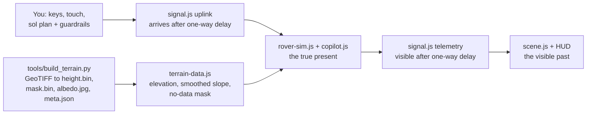

### The level model

Every level in `web/levels.js` separates three independent axes, so no other module ever branches on a level name or asset directory:

| Axis | Values | Drives |
|---|---|---|
| `planet` | `"moon"` \| `"mars"` | Rendering look only: sky, lighting, ground/rock/dust color, texture detail (`scene.js`'s `LOOK` table, `sky.js`, `ground-fx.js`, `textures.js`). |
| `mode` | `"live"` \| `"plan"` | Mission logic: `"live"` routes WASD/touch input straight to the rover; `"plan"` gates the stall clock on the uplinked plan actually going active (`web/mission.js`), and switches the HUD to the waypoint/guardrail panel. |
| `delay` | `{type:"direct", oneWaySec}` \| `{type:"relay", fallbackOneWaySec, pathLabel}` \| `{type:"mars-scenarios"}` | How the one-way delay is resolved each run (`resolveDelaySec` in `web/levels.js`). `relay` reads the real value from the loaded terrain's `meta.delayModel.oneWaySec` if the asset ships one, otherwise uses the fallback, clearly labelled as one, on screen. |

`assetKey` is separate again: it's only ever used to pick the `assets/<assetKey>/` directory to fetch (`terrain-data.js`); several levels can share one (Tycho and Lunokhod are both `planet: "moon"`, but Tycho's `assetKey` is `"moon"` and Lunokhod's is `"lunokhod"`).

A level with a real, still-there object at its goal (a parked rover, a lander) sets `landmarkKind` (one of `lunokhod2`, `change4`, `lrv`) to place an illustrative model there - see `web/landmarks.js` and the per-model files (`lunokhod-parked.js`, `change4-lander.js`, `apollo-lrv.js`). Its facing comes from the terrain's own `meta.json` (`landmarkHeadingDeg` or a compass string `landmarkHeadingCompass`), defaulting to south if the asset names none - never invented in code.

**To add a new site:** run the data pipeline to produce `assets/<key>/{height.bin,meta.json,mask.bin,albedo.jpg}`, add one entry to `LEVELS` in `web/levels.js` (planet, mode, delay, optional `landmarkKind`/`arrivalLine`), add its key to `LEVEL_ORDER`, add brief lines to `BRIEFS` in `web/mission.js`, and add a `.level-btn` + `.level-card` pair in `web/index.html`. The engine (terrain loading, mission state, HUD, scoreboard, share text) needs no other changes; `tests/levels.test.mjs` and the parameterized bots in `tests/playability.test.mjs` pick the new level up automatically (the bots SKIP with an explicit reason, not a silent pass, until the level's real assets are present).

### The delay model: true present vs visible past

The simulation runs on a fixed 60 Hz clock in the *true present*. `web/signal.js` is a pure module with two independent queues:

- **Uplink.** A command sent at time `t` is delivered to the rover at `t + delay`.
- **Telemetry.** A rover state sent at time `t` becomes visible to you at `t + delay`.

The renderer and HUD only ever draw the latest telemetry that has arrived. A full round trip, from key press to seeing the result, is twice the one-way delay. The HUD shows how old the picture is ("Telemetry from 1.3 s ago") and how many commands are still in flight. Mission status (arrived, tipped, stalled, held) is also decided from delayed telemetry, which is why the game can end while the real rover is still rolling. At the end a translucent ghost shows the true position.

### The co-pilot and its guardrails

When a sol plan arrives on Mars, `planRoute` in `web/copilot.js` runs on the rover side against the true terrain and true position. It checks each leg by sampling slope every 2 m.

| Guardrail | Default | What it does |
|---|---|---|
| Max slope | 25 degrees | Any leg crossing steeper ground is a hazard. |
| Hazard mode | reroute | `reroute` runs a grid A* around the hazard on the slope grid, within the lookahead radius. `stop` holds at the hazard. |
| Max autonomous distance | 3,000 m | Total plan length cap. Past it the co-pilot holds. |
| Reroute lookahead | 60 m | How far from the straight leg a detour may go. |

No-data cells count as infinite cost, and A* checks every step as a segment, not just its endpoints, so a detour can't slip across a narrow hazard. If there's no safe detour, the co-pilot holds and says why (for example `HOLD: no safe path around the hazard within the lookahead radius`). You find out one delay later: the rerouted path, the red HOLD light and the hazard flash all travel back to you inside telemetry, so nothing on screen shows the present early.

The REAL run drives that same plan through `web/sol-sim.js`'s `autopilotStep` - the identical per-tick steer/step/hold loop the Flight Rules dry run's `ensemble.js`/`runSolPlan` use headlessly - so main.js never carries a second, quietly-divergent copy of this logic. `web/mars-run.js`'s `createMarsAutopilot` plans the same per-leg boundaries the dry run computes, so the real run's end-of-mission leg grid (`ok`/`held`/`tipped`/`unreached`, one glyph per waypoint) is directly comparable to what the dry run predicted. See [Flight Rules](#flight-rules-the-dry-run) above for the drift model itself.

### Rover-scale slope smoothing

A stereo DEM is noisy at the single-pixel level, and a rover doesn't feel one pixel: it feels the ground under its wheelbase. Measuring slope from one pixel's immediate neighbors lets stereo-correlation noise read as steep ground. `buildSlopeGrid` in `web/terrain-data.js` box-blurs the elevations so slope is measured over a 3 m baseline, about the size of a small rover, then samples that grid bilinearly. The physics (`rover-sim.js`) and the co-pilot (`copilot.js`) both read the same `terrain.slopeDeg()`, so they can't disagree about what's too steep. Two unit tests pin this down: a flat plane with plus or minus 0.5 m checkerboard noise must read under 10 degrees, and a real 52 degree ramp must still read steep. Swap the old per-pixel slope back in and the Moon playability bot below fails. Put the smoothing back and it passes.

### The data pipeline

`tools/build_terrain.py` downloads each source GeoTIFF, processes it, writes the four asset files per body and deletes the raw download. Along the way:

- **Georeferencing is parsed by hand.** `tools/tiff_ifd.py` reads the raw TIFF IFD and GeoKeys (PIL can read the pixels but not the GeoTIFF tags). `tools/georef.py` does the spherical Equirectangular pixel-to-lat/lon math. As a check, the Mars raster's computed corners (17.58 to 19.29 N, 76.99 to 78.58 E) match the extent the source publishes.
- **The landing site** (18.4447 N, 77.4508 E) comes from Wikidata `Q105824100`, Octavia E. Butler Landing, which cites NASA's Mars 2020 location map, cross-checked against Wikipedia.
- **No-data handling.** Missing stereo cells are filled for the mesh, but `mask.bin` records which cells were filled. The game renders them hatched and treats them as impassable, and spawn and goal are kept at least 20 px clear.
- **Shading** (hillshade plus slope) is computed at native resolution and then area-resampled to avoid moire. The result is `albedo.jpg`.
- **Playability fixes** live in `tools/patch_playability_sites.py`, with the reason for each move written into `meta.json`.

### Testing

`npm run gate` runs three stages and fails on any of them:

1. **Lint:** a syntax check over every module.
2. **Unit tests:** `node:test` cases (235 passing, 0 `SKIP`s - every shipped level's real assets are in this checkout) covering the signal link, rover physics, co-pilot, mission state machine, telemetry-only views, load races, scoreboard (including abandoned-run exclusion, the v1-to-v2 level-key migration, and Flight Rules calibration), share-result formatting (including the leg-outcome grid), objectives/par, terrain sampling, the level model itself (`tests/levels.test.mjs`), and Flight Rules (`tests/prng`, `drift`, `sol-sim`, `ensemble`, `dry-run`, `mars-run.test.mjs`): the drift model's median-offset math, `runSolPlan`/`autopilotStep` parity with the pre-drift Mars playability result at `driftPct=0`, the shipped mixed-outcome Mars fixture, the chunked dry-run fallback's output pinned byte-for-byte against `ensemble.js`'s own synchronous result, the real-run seed picker's guarantee of never replaying a dry-run seed, the shared true/believed path downsampler (`sol-sim.js`'s `createPathSampler`), and the real-run drift reveal's line formatter and track sampler (`mars-run.js`'s `formatRealDriftLine`/`createMarsTrackReveal`), and the drift reveal's fitted-view/zoomed-inset math, including the opposite-corner inset placement (`web/hud-tracks-fit.js`'s `computeTrackFit`/`pickInsetCorner`/`insetScreenRect`, `tests/hud-tracks.test.mjs` and `tests/hud-tracks-fit.test.mjs`).
3. **Boot probe:** `scripts/verify_boot.mjs` serves the repo and drives the real game in headless Chromium with WebGL, including placing waypoints and pressing Dry run through the real DOM (not just the debug API) and proving the render loop keeps advancing while it runs off-thread.

The unit tests include **playability bots** (`tests/playability.test.mjs`), parameterized over every level in `LEVEL_ORDER`. They load the real shipped DEMs and must actually win, running the real mission state machine; a level whose `assets/<key>/` isn't in the checkout yet `SKIP`s with the reason ("assets/.../ not present in this worktree (data lane pending)") instead of silently passing. The Lunokhod and Tycho bots only see telemetry through `signal.js`, 1.28 s stale, and steer a safety-buffered A* route to the goal without tipping or touching no-data ground; Lunokhod's crater-field microterrain needed a pure-pursuit lookahead (steer at a point up to 20 m ahead on the route, not just the next grid cell) to drive it at a realistic speed instead of crawling - the same technique now backs the generic live-mode bot used for any new live level. The Mars bot uplinks a plan through each of the three delay settings (3, 12 and 22 min real, compressed) on the shipped default guardrails and must arrive every time; the same shape (generalized) backs any future plan-mode level. Two real bugs surfaced this way: at the two longer Mars delays the stall timer started before the player could even see the rover move, so those runs could never be won; and Lunokhod's real terrain forced long stretches without straight-line progress toward the goal while going around microterrain, which needed the stall timeout raised from 20 s to 75 s (an honest widening of a fairness margin, not a special case for the bot). The bots are also the proof that the slope smoothing matters, as described in the section above.

The boot probe checks that the real DEM renders on the flagship Lunokhod level, that the rover's true state doesn't move until the one-way delay has passed (observed: about 1.4 s for 1.28 s), and that your view doesn't change until the round trip is done (observed: about 2.7 s for 2.56 s). A debug win near the Lunokhod goal also proves the end card's objectives render and mark the win met. It also confirms Tycho boots cleanly, that a Mars plan waits out its 12 s compressed delay, that the co-pilot holds instead of driving onto a slope it's forbidden to cross, and that switching from Tycho to Mars clears Tycho's status line instead of leaving it stuck on screen. A fresh Mars run then proves the drift reveal's present-time rule end to end: the "Drift this run" line and the true/believed track minimap are absent (not just hidden - actually invisible) while the mission is still active, appear only once it reaches a terminal status, and are gone again after a retry. It then places waypoints and presses Dry run through the real DOM (not the debug API): asserts a full 100-result outcome breakdown and the always-present drift label render, and - by sampling a frame counter and `getLiveLoopCount()` while the async run is still in flight - that the render loop never stalls, never doubles up, while it runs. It then iterates every other level in `LEVEL_ORDER`: one whose assets are present in the checkout gets the same real-DEM + positive-delay proof; one without is logged and skipped, not asserted against - that gate belongs to the data pipeline lane, not this one.

The Python pipeline has its own 48 offline tests: georef round trips (including the Lunokhod raster's different GeoKey combination), nodata fill and mask, resampling, site picking (including the directional spawn picker used by Lunokhod, Chang'e-4, and Apollo 17), the meta schema, and the Chang'e-4/Apollo 17 far-side relay light-time model (`tools/test_relay.py`).

## Run it locally

The game is static files. From the repo root:

```sh
python3 -m http.server
```

Then open <http://localhost:8000/>. The root page redirects to `web/`.

**Requirements**

| For | You need |
|---|---|
| Playing | Any static file server and a WebGL browser |
| `npm run gate` | Node 22. The boot probe also needs [Playwright](https://playwright.dev/) with Chromium: `npm install` (it's the only devDependency) then `npx playwright install chromium-headless-shell`. If Playwright already lives in another project, point `TYCHO_PLAYWRIGHT_FROM` at that project's `package.json` instead. |
| Rebuilding terrain | Python 3 with `numpy`, `pillow` and `scipy`, plus `curl`. The downloads are about 212 MB (Moon) and 90 MB (Mars), one at a time. |

**Commands**

```sh
npm run gate                                         # lint + 235 unit tests + headless boot probe
python3 tools/build_terrain.py all                   # re-download and rebuild the Tycho and Mars terrains
python3 tools/build_terrain.py lunokhod              # re-download and rebuild the Lunokhod terrain (not part of "all")
python3 tools/patch_playability_sites.py             # re-apply the documented spawn/goal fixes
python3 -m unittest discover -s tools -p "test_*.py" # pipeline tests
```

## Facts on screen, with sources

The delays and the 1970s crews show up in the game itself. The rest is context for this page. Each one was checked against the source linked next to it.

| Fact | Source |
|---|---|
| Moon one-way delay: **1.28 s** | NASA gives the Moon's average distance as 384,400 km ([NASA Science, Moon facts](https://science.nasa.gov/moon/facts/)). 384,400 km at the speed of light is 1.28 s. |
| Mars one-way delay: **about 3 min** at the closest approaches | At the 2003 close approach Earth and Mars were 55.8 million km apart ([NASA Science, Mars: Closest Encounter](https://science.nasa.gov/missions/hubble/mars-closest-encounter/)). That's 3.1 min at light speed. |
| Mars one-way delay: **up to about 22 min** at the far end of the range | NASA's Moon to Mars architecture paper plots a representative crewed mission with a "maximum one-way communications delay of 22 minutes" ([NASA, Mars Communications Disruption and Delay, PDF](https://www.nasa.gov/wp-content/uploads/2024/01/mars-communications-disruption-and-delay.pdf)). ESA's Mars Express team rounds the full range to about 4 to 24 minutes ([ESA](https://blogs.esa.int/mex/2012/08/05/time-delay-between-mars-and-earth/)). |
| Lunokhod 1 was **driven live from Earth by a five-person team** (1970) | "guided in real-time by a five person team" ([NASA APOD, 9 January 1999](https://science.nasa.gov/image-article/apod-1999-january-09-lunokhod-moon-robot/)) |
| Lunokhod 2 landed **15 January 1973** and was **controlled remotely from Earth** | "The ensemble was launched on 11 January 1973 and the landing occurred on 15 January" and "The rover was controlled remotely by a team of Soviet controllers on Earth." ([LROC, Lunokhod 2 Revisited, post 699](https://lroc.im-ldi.com/posts/699)) |
| Lunokhod 2 is **still parked at 25.830 N, 30.914 E**, facing southeast, lid still open | "Lunokhod 2 rover is still parked on the floor of the crater Le Monnier (25.830°N, 30.914°E)" and "Lunokhod 2 rover parked facing southeast with the lid still open." ([LROC, Lunokhod 2 Revisited, post 699](https://lroc.im-ldi.com/posts/699)) |
| Chang'e-4's lander sits at **45.457 S, 177.589 E, ± 20 m** (LRO frame, matching the shipped DTM) | "The Chang'e 4 spacecraft set down between the two arrows at 45.457 S, 177.589 E, plus or minus 20 meters." ([LROC post 1087, "Chang'e 4 Lander Coordinates"](https://lroc.im-ldi.com/posts/1087)) |
| Chang'e-4 landed on the lunar far side **3 January 2019**; Liu et al.'s own LRO-frame position (177.5885°E, 45.4561°S, −5927 m) agrees with LROC's within ~20 m; their other, more-often-quoted coordinate (177.5991°E, 45.4446°S) is in a *different* frame (CE2TMap2015) and is 415 m off in the LRO frame this DTM uses | "We confirmed that the precise location of the landing site is 177.5991°E, 45.4446°S with an elevation of −5935 m." and, later, "Compared with the positioning results of the landing site based on LRO terrain data (177.5885°E, 45.4561°S, −5927m) 24 , our results show a 226 m deviation along the latitude direction and a 348 m deviation along the longitude direction. The total positional deviation is 415 m" and "The Chang'E-4 (CE-4) spacecraft successfully landed on the lunar farside on January 3, 2019." ([Liu, B. et al. 2019, Nature Communications 10:4229](https://pmc.ncbi.nlm.nih.gov/articles/PMC6760200/)) |
| Queqiao's halo-orbit Z-amplitude is **about 13,000 km**, with distance to the Moon ranging **47,000-79,000 km** | "Z-amplitude of 13,000 km ... longest distance to the Moon is 79,000 km, and the shortest one is 47,000 km" ([Space: Science & Technology, 2021, "Development and Prospect of Chinese Lunar Relay Communication Satellite"](https://spj.science.org/doi/10.34133/2021/3471608)) |
| The Apollo 17 LRV is **still parked at 20.1896 N, 30.7769 E** | Crewed-missions table, row "Apollo 17 LRV \| 20.1896 \| 30.7769 \| -2628 \| 3.2" (mean observed lat/lon, elevation m, uncertainty m) ([LROC, Spacecraft Related Coordinates - 2016 Update](https://lroc.im-ldi.com/images/938)) |
| Apollo 17 (December 1972) was **the last crewed Moon landing**, and the astronauts drove the real LRV themselves with no delay | "The Apollo Program's last lunar landing mission, and the first to include an astronaut-scientist, landed in the Moon's Taurus-Littrow Valley" ([NASA, Apollo 17](https://www.nasa.gov/mission/apollo-17/)); "Three LRVs were driven on the Moon, ... and one on Apollo 17 by Gene Cernan and Harrison Schmitt" ([NASA NSSDC, Apollo Lunar Roving Vehicle](https://nssdc.gsfc.nasa.gov/planetary/lunar/apollo_lrv.html)) |
| Perseverance's top speed is **0.152 km/h** | "just under 0.1 mph (152 meters per hour)" on flat, hard ground ([NASA Science, Perseverance rover components](https://science.nasa.gov/mission/mars-2020-perseverance/rover-components/)) |

TYCHO itself is much faster than Perseverance (up to 3 m/s). That's a game choice so a run takes minutes, not days.

## Credits and licenses

- **Lunokhod site terrain:** LROC NAC DTM `NAC_DTM_LUNOKHOD2`, credit **NASA/GSFC/Arizona State University**. "LROC Reduced Data Record (RDR) products available through the NASA Planetary Data System (PDS) are in the public domain." [Product page](https://data.lroc.im-ldi.com/lroc/view_rdr/NAC_DTM_LUNOKHOD2).
- **Tycho terrain:** LROC NAC DTM `NAC_DTM_TYCHOPK01`, credit **NASA/GSFC/Arizona State University**. Same PDS public-domain terms. [Product page](https://data.lroc.im-ldi.com/lroc/view_rdr/NAC_DTM_TYCHOPK01).
- **Mars terrain:** USGS CTX DEM `M20_JezeroCrater_CTXDEM_20m`, credit **NASA/JPL-Caltech/MSSS/USGS** (USGS Astrogeology). Under NASA's data policy, "data from a NASA-led mission is licensed as Creative Commons Zero (CC0); public domain, no usage restrictions." [Source directory](https://planetarymaps.usgs.gov/mosaic/mars2020_trn/CTX/ScienceInvestigationMaps_JPL/).
- **Chang'e-4 terrain:** LROC NAC DTM `NAC_DTM_CHANGE4`, credit **NASA/GSFC/Arizona State University**. Same PDS public-domain terms. [Product page](https://data.lroc.im-ldi.com/lroc/view_rdr/NAC_DTM_CHANGE4). Position: [LROC post 1087](https://lroc.im-ldi.com/posts/1087); landing date and LRO-frame elevation: [Liu, B. et al. 2019, Nature Communications 10:4229](https://pmc.ncbi.nlm.nih.gov/articles/PMC6760200/).
- **Apollo 17 terrain:** LROC NAC DTM `NAC_DTM_APOLLO17`, credit **NASA/GSFC/Arizona State University**. Same PDS public-domain terms. [Product page](https://data.lroc.im-ldi.com/lroc/view_rdr/NAC_DTM_APOLLO17). LRV coordinates: [LROC, Spacecraft Related Coordinates - 2016 Update](https://lroc.im-ldi.com/images/938).
- **Rendering:** [three.js](https://threejs.org/), MIT License.
- **Fonts:** IBM Plex, loaded from Google Fonts, SIL Open Font License.
- **Code:** MIT, see [LICENSE](LICENSE).

TYCHO is an independent project. It isn't affiliated with or endorsed by NASA, ESA, USGS, JPL or Arizona State University.

## Built by

**Tarang (TJ) Jammalamadaka.** UW Bothell MIS '27, applied AI engineer. [GitHub](https://github.com/tarang-tj) · [Portfolio](https://tarang-tj.github.io/)

I built TYCHO to feel the gap between having a human in the loop and trusting autonomy when the loop is too slow, the same question that comes up whenever you hand real decisions to an AI agent.
