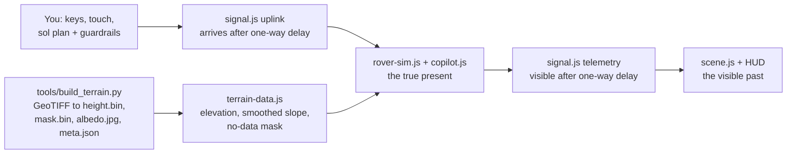

# TYCHO

**Drive a small rover across the real Moon and Mars, with the real speed-of-light delay between you and it.**

[](LICENSE)
[](#run-it-locally)
[](https://threejs.org/)


<sub>In-engine capture on the real LROC elevation model of Tycho's central peak (HUD hidden for this one shot). Earth's position in the sky is approximate.</sub>

**[Play it in your browser: tarang-tj.github.io/tycho](https://tarang-tj.github.io/tycho/)**

No install, no account. Built for desktop and phone browsers with WebGL.

---

## Why this exists

On the Moon, a human can steer a rover live. Radio takes about 1.28 seconds to get there, so you press a key, wait a beat, and see what happened. Soviet crews did exactly that with Lunokhod 1 in 1970 and Lunokhod 2 in 1973.

On Mars you can't. The signal takes minutes each way, so by the time you see a cliff edge on your screen, the rover reached it long ago. That's why Mars rovers get a plan for the day and drive themselves between commands.

TYCHO lets you feel that difference with your own hands. Two levels are live driving with a short lag, on two different real Moon sites. The third is planning, handing over control, and trusting the co-pilot, on Mars. Everything you see on screen is telemetry from the past, and when the run ends the game shows you where the rover really was.

## How to play

**Level 1: Lunokhod (Moon, Le Monnier crater).** Drive to where the real Lunokhod 2 rover has been parked since 1973, at 25.830 N, 30.914 E.

**Level 2: Tycho (Moon, Tycho central peak).** Drive the last stretch up to the high-point marker near the top of Tycho's central peak.

| Input | Action |
|---|---|
| `W` `A` `S` `D` or arrow keys | Drive and steer |
| On-screen pad | Same, on touch screens |
| Drag / scroll / pinch | Look around and zoom |

Every change in your input is sent to the rover and lands 1.28 s later. The picture you steer by is 1.28 s old. Too steep a slope and TYCHO tips. Reaching Lunokhod 2 doesn't end the mission in fiction: the game shows a short, sourced line ("You reached Lunokhod 2. It has been parked here since 1973.") and nothing more.

**Level 3: Jezero (Mars, near the Perseverance landing site).** Reach the goal marker near the base of the delta.

1. Pick a delay scenario (close approach, typical, or near conjunction). The real one-way delay is always shown next to the compression factor used for play.
2. Click the minimap to place up to 5 waypoints, or use the keyboard: arrow keys move a cursor, `Enter` places a waypoint, `Backspace` removes the last one, `U` uplinks. A click near the goal snaps onto it. That's your sol plan.
3. Set the guardrails: **max slope**, **max autonomous distance**, **reroute lookahead**, and whether **co-pilot reroute assist** is on (reroute around hazards) or off (stop at the first one).
4. Hit **Uplink plan** and wait for the signal to arrive. TYCHO's co-pilot drives the plan against the terrain as it really is, then reports back one delay later.

The goal is about 1.8 km out. The default autonomous distance cap (3 km) covers it, so a first plan can win on the defaults at every delay setting. Lower the cap to see the co-pilot hold.

After each run a scoreboard compares success with and without the co-pilot. With fewer than 5 runs it says so: `too few runs to trust this rate`. Switching levels or retrying mid-run records that run as **abandoned** and excludes it from every success rate, so walking away from a run never counts against (or for) you.

Every end card has a **Copy result** button: it copies a plain-text summary (level, outcome, time, delay, co-pilot on/off, and the game's link) to your clipboard, for sharing.

## Screenshots

| | |
|---|---|
|  |  |
| **Title.** Three levels, three real sites. | **Lunokhod.** The parked Lunokhod 2, an illustrative model, labeled at its real surveyed position. |
|  |  |
| **Tycho.** Live driving up the central peak. The status line shows your last command on its way, and the telemetry you're steering by is 1.3 s old. | **Jezero.** Mid-plan on the real Jezero floor. Real one-way delay 3 min, compressed 15x and labeled on screen. Everything in the panel is 12 s old. |
|  | |
| **The reveal.** The solid rover is what you saw. The ghost is where TYCHO really was at that moment. | |

<p align="center"></p>

## What's real and what isn't

Honesty is the point of this project, so here's the line, drawn plainly. The same list lives in the game under **About the data**.

| | What | Details |
|---|---|---|
| **Real** | Lunokhod site elevation | LROC NAC DTM `NAC_DTM_LUNOKHOD2` (Le Monnier crater, native 5 m/px). A 5.12 km square crop at native resolution, centered on Lunokhod 2's parked position. 472 m of relief in the crop. |
| **Real** | Lunokhod 2's parked position | 25.830 N, 30.914 E, facing southeast, lid still open. From LROC post 699, "Lunokhod 2 Revisited". The parked-rover model in the goal spot is an illustrative period-accurate silhouette, not a survey model. |
| **Real** | Tycho elevation | LROC NAC DTM `NAC_DTM_TYCHOPK01` (Tycho central peak, native 2 m/px). A 2.4 km square crop resampled to 1024 x 1024, about 2.34 m/px. 1,857 m of relief in the crop. |
| **Real** | Mars elevation | USGS CTX DEM `M20_JezeroCrater_CTXDEM_20m` at native 20 m/px. A 1024 x 1024 window (20.48 km square) centered on the Perseverance landing site, 18.4447 N, 77.4508 E. |
| **Real** | Moon signal delay (Lunokhod and Tycho) | 1.28 s one way, driven live with no compression. |
| **Real, compressed** | Mars signal delay | The real one-way value (3, 12 or 22 min) is always on screen. Play time is compressed 15x, 40x or 55x, so the one-way wait is 12 to 24 s. The compression factor is on screen too. |
| **Real limits, documented in code** | Physics | Rover tips above 32 degrees of slope (`web/rover-sim.js`). The co-pilot's default guardrail is a more cautious 25 degrees (`web/copilot.js`). Slope is measured over a rover-scale 3 m baseline. |
| **Real gaps** | No-data areas | Where the orbital stereo model has no data, the ground is dimmed and hatched and treated as impassable. The rover stops there and the co-pilot won't route through it. Lunokhod's crop has almost none (0.076% of cells); the Tycho crop, cut from a rotated swath edge, has more. |
| **Procedural** | Near-field detail | Small craters, rocks and fine surface texture near the rover are generated decoration. Only the large-scale shape comes from the DEM. |
| **Approximate** | Earth in the lunar sky | Shown at a realistic apparent size, but its sky position is illustrative, not an ephemeris. |
| **Not photos** | Surface color | Shaded from the elevation data with a Moon or Mars palette. No orbital imagery is used. |
| **Data-driven proxies** | Tycho and Mars spawn/goal | Picked by code from the DEM (lowest safe slope, highest reachable point, roughness near the delta), then moved where testing showed the original spot couldn't be won. Every move is logged in `assets/*/meta.json`. Lunokhod's goal is not a proxy (it's the real parked-rover coordinate); its spawn is a code-picked point 2.06 km south, along the rover's real historic approach direction. |

## How it works

TYCHO is plain ES modules in the browser. three.js 0.169 comes from a CDN through an import map. There's no bundler and no build step: the files in `web/` are what ships.



### The delay model: true present vs visible past

The simulation runs on a fixed 60 Hz clock in the *true present*. `web/signal.js` is a pure module with two independent queues:

- **Uplink.** A command sent at time `t` is delivered to the rover at `t + delay`.
- **Telemetry.** A rover state sent at time `t` becomes visible to you at `t + delay`.

The renderer and HUD only ever draw the latest telemetry that has arrived. A full round trip, from key press to seeing the result, is twice the one-way delay. The HUD shows how old the picture is ("Telemetry from 1.3 s ago") and how many commands are still in flight. Mission status (arrived, tipped, stalled, held) is also decided from delayed telemetry, which is why the game can end while the real rover is still rolling. At the end a translucent ghost shows the true position.

### The co-pilot and its guardrails

When a sol plan arrives on Mars, `planRoute` in `web/copilot.js` runs on the rover side against the true terrain and true position. It checks each leg by sampling slope every 2 m.

| Guardrail | Default | What it does |
|---|---|---|
| Max slope | 25 degrees | Any leg crossing steeper ground is a hazard. |
| Hazard mode | reroute | `reroute` runs a grid A* around the hazard on the slope grid, within the lookahead radius. `stop` holds at the hazard. |
| Max autonomous distance | 3,000 m | Total plan length cap. Past it the co-pilot holds. |
| Reroute lookahead | 60 m | How far from the straight leg a detour may go. |

No-data cells count as infinite cost, and A* checks every step as a segment, not just its endpoints, so a detour can't slip across a narrow hazard. If there's no safe detour, the co-pilot holds and says why (for example `HOLD: no safe path around the hazard within the lookahead radius`). You find out one delay later: the rerouted path, the red HOLD light and the hazard flash all travel back to you inside telemetry, so nothing on screen shows the present early.

### Rover-scale slope smoothing

A stereo DEM is noisy at the single-pixel level, and a rover doesn't feel one pixel: it feels the ground under its wheelbase. Measuring slope from one pixel's immediate neighbors lets stereo-correlation noise read as steep ground. `buildSlopeGrid` in `web/terrain-data.js` box-blurs the elevations so slope is measured over a 3 m baseline, about the size of a small rover, then samples that grid bilinearly. The physics (`rover-sim.js`) and the co-pilot (`copilot.js`) both read the same `terrain.slopeDeg()`, so they can't disagree about what's too steep. Two unit tests pin this down: a flat plane with plus or minus 0.5 m checkerboard noise must read under 10 degrees, and a real 52 degree ramp must still read steep. Swap the old per-pixel slope back in and the Moon playability bot below fails. Put the smoothing back and it passes.

### The data pipeline

`tools/build_terrain.py` downloads each source GeoTIFF, processes it, writes the four asset files per body and deletes the raw download. Along the way:

- **Georeferencing is parsed by hand.** `tools/tiff_ifd.py` reads the raw TIFF IFD and GeoKeys (PIL can read the pixels but not the GeoTIFF tags). `tools/georef.py` does the spherical Equirectangular pixel-to-lat/lon math. As a check, the Mars raster's computed corners (17.58 to 19.29 N, 76.99 to 78.58 E) match the extent the source publishes.
- **The landing site** (18.4447 N, 77.4508 E) comes from Wikidata `Q105824100`, Octavia E. Butler Landing, which cites NASA's Mars 2020 location map, cross-checked against Wikipedia.
- **No-data handling.** Missing stereo cells are filled for the mesh, but `mask.bin` records which cells were filled. The game renders them hatched and treats them as impassable, and spawn and goal are kept at least 20 px clear.
- **Shading** (hillshade plus slope) is computed at native resolution and then area-resampled to avoid moire. The result is `albedo.jpg`.
- **Playability fixes** live in `tools/patch_playability_sites.py`, with the reason for each move written into `meta.json`.

### Testing

`npm run gate` runs three stages and fails on any of them:

1. **Lint:** a syntax check over every module.
2. **Unit tests:** 83 `node:test` cases covering the signal link, rover physics, co-pilot, mission state machine, telemetry-only views, load races, scoreboard (including abandoned-run exclusion and the v1-to-v2 level-key migration), share-result formatting, and terrain sampling.
3. **Boot probe:** `scripts/verify_boot.mjs` serves the repo and drives the real game in headless Chromium with WebGL.

The unit tests include **playability bots** (`tests/playability.test.mjs`). They load the real shipped DEMs and must actually win. All bots run the real mission state machine. The Lunokhod and Tycho bots only see telemetry through `signal.js`, 1.28 s stale, and steer a safety-buffered A* route to the goal without tipping or touching no-data ground; Lunokhod's crater-field microterrain needed a pure-pursuit lookahead (steer at a point up to 20 m ahead on the route, not just the next grid cell) to drive it at a realistic speed instead of crawling. The Mars bot uplinks a plan through each of the three delay settings (3, 12 and 22 min real, compressed) on the shipped default guardrails and must arrive every time. Two real bugs surfaced this way: at the two longer Mars delays the stall timer started before the player could even see the rover move, so those runs could never be won; and Lunokhod's real terrain forced long stretches without straight-line progress toward the goal while going around microterrain, which needed the stall timeout raised from 20 s to 75 s (an honest widening of a fairness margin, not a special case for the bot). The bots are also the proof that the slope smoothing matters, as described in the section above.

The boot probe checks that the real DEM renders on the flagship Lunokhod level, that the rover's true state doesn't move until the one-way delay has passed (observed: about 1.4 s for 1.28 s), and that your view doesn't change until the round trip is done (observed: about 2.7 s for 2.56 s). It also confirms Tycho boots cleanly, that a Mars plan waits out its 12 s compressed delay, that the co-pilot holds instead of driving onto a slope it's forbidden to cross, and that switching from Tycho to Mars clears Tycho's status line instead of leaving it stuck on screen.

The Python pipeline has its own 34 offline tests: georef round trips (including the Lunokhod raster's different GeoKey combination), nodata fill and mask, resampling, site picking (including the new directional picker used to place Lunokhod's spawn) and the meta schema.

## Run it locally

The game is static files. From the repo root:

```sh
python3 -m http.server
```

Then open <http://localhost:8000/>. The root page redirects to `web/`.

**Requirements**

| For | You need |
|---|---|
| Playing | Any static file server and a WebGL browser |
| `npm run gate` | Node 22. The boot probe also needs [Playwright](https://playwright.dev/) with Chromium: `npm install` (it's the only devDependency) then `npx playwright install chromium-headless-shell`. If Playwright already lives in another project, point `TYCHO_PLAYWRIGHT_FROM` at that project's `package.json` instead. |
| Rebuilding terrain | Python 3 with `numpy`, `pillow` and `scipy`, plus `curl`. The downloads are about 212 MB (Moon) and 90 MB (Mars), one at a time. |

**Commands**

```sh
npm run gate                                         # lint + 83 unit tests + headless boot probe
python3 tools/build_terrain.py all                   # re-download and rebuild the Tycho and Mars terrains
python3 tools/build_terrain.py lunokhod              # re-download and rebuild the Lunokhod terrain (not part of "all")
python3 tools/patch_playability_sites.py             # re-apply the documented spawn/goal fixes
python3 -m unittest discover -s tools -p "test_*.py" # pipeline tests
```

## Facts on screen, with sources

The delays and the 1970s crews show up in the game itself. The rest is context for this page. Each one was checked against the source linked next to it.

| Fact | Source |
|---|---|
| Moon one-way delay: **1.28 s** | NASA gives the Moon's average distance as 384,400 km ([NASA Science, Moon facts](https://science.nasa.gov/moon/facts/)). 384,400 km at the speed of light is 1.28 s. |
| Mars one-way delay: **about 3 min** at the closest approaches | At the 2003 close approach Earth and Mars were 55.8 million km apart ([NASA Science, Mars: Closest Encounter](https://science.nasa.gov/missions/hubble/mars-closest-encounter/)). That's 3.1 min at light speed. |
| Mars one-way delay: **up to about 22 min** at the far end of the range | NASA's Moon to Mars architecture paper plots a representative crewed mission with a "maximum one-way communications delay of 22 minutes" ([NASA, Mars Communications Disruption and Delay, PDF](https://www.nasa.gov/wp-content/uploads/2024/01/mars-communications-disruption-and-delay.pdf)). ESA's Mars Express team rounds the full range to about 4 to 24 minutes ([ESA](https://blogs.esa.int/mex/2012/08/05/time-delay-between-mars-and-earth/)). |
| Lunokhod 1 was **driven live from Earth by a five-person team** (1970) | "guided in real-time by a five person team" ([NASA APOD, 9 January 1999](https://science.nasa.gov/image-article/apod-1999-january-09-lunokhod-moon-robot/)) |
| Lunokhod 2 landed **15 January 1973** and was **controlled remotely from Earth** | "The ensemble was launched on 11 January 1973 and the landing occurred on 15 January" and "The rover was controlled remotely by a team of Soviet controllers on Earth." ([LROC, Lunokhod 2 Revisited, post 699](https://lroc.im-ldi.com/posts/699)) |
| Lunokhod 2 is **still parked at 25.830 N, 30.914 E**, facing southeast, lid still open | "Lunokhod 2 rover is still parked on the floor of the crater Le Monnier (25.830°N, 30.914°E)" and "Lunokhod 2 rover parked facing southeast with the lid still open." ([LROC, Lunokhod 2 Revisited, post 699](https://lroc.im-ldi.com/posts/699)) |
| Perseverance's top speed is **0.152 km/h** | "just under 0.1 mph (152 meters per hour)" on flat, hard ground ([NASA Science, Perseverance rover components](https://science.nasa.gov/mission/mars-2020-perseverance/rover-components/)) |

TYCHO itself is much faster than Perseverance (up to 3 m/s). That's a game choice so a run takes minutes, not days.

## Credits and licenses

- **Lunokhod site terrain:** LROC NAC DTM `NAC_DTM_LUNOKHOD2`, credit **NASA/GSFC/Arizona State University**. "LROC Reduced Data Record (RDR) products available through the NASA Planetary Data System (PDS) are in the public domain." [Product page](https://data.lroc.im-ldi.com/lroc/view_rdr/NAC_DTM_LUNOKHOD2).
- **Tycho terrain:** LROC NAC DTM `NAC_DTM_TYCHOPK01`, credit **NASA/GSFC/Arizona State University**. Same PDS public-domain terms. [Product page](https://data.lroc.im-ldi.com/lroc/view_rdr/NAC_DTM_TYCHOPK01).
- **Mars terrain:** USGS CTX DEM `M20_JezeroCrater_CTXDEM_20m`, credit **NASA/JPL-Caltech/MSSS/USGS** (USGS Astrogeology). Under NASA's data policy, "data from a NASA-led mission is licensed as Creative Commons Zero (CC0); public domain, no usage restrictions." [Source directory](https://planetarymaps.usgs.gov/mosaic/mars2020_trn/CTX/ScienceInvestigationMaps_JPL/).
- **Rendering:** [three.js](https://threejs.org/), MIT License.
- **Fonts:** IBM Plex, loaded from Google Fonts, SIL Open Font License.
- **Code:** MIT, see [LICENSE](LICENSE).

TYCHO is an independent project. It isn't affiliated with or endorsed by NASA, ESA, USGS, JPL or Arizona State University.

## Built by

**Tarang (TJ) Jammalamadaka.** UW Bothell MIS '27, applied AI engineer. [GitHub](https://github.com/tarang-tj) · [Portfolio](https://tarang-tj.github.io/)

I built TYCHO to feel the gap between having a human in the loop and trusting autonomy when the loop is too slow, the same question that comes up whenever you hand real decisions to an AI agent.
